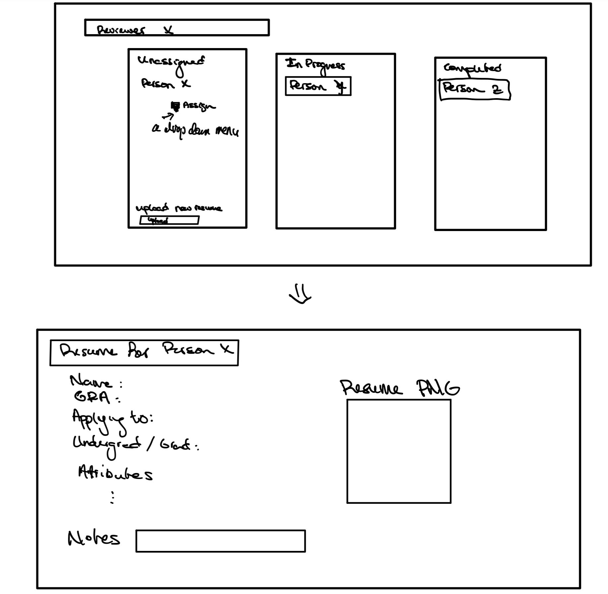

# Dashboard
This is the dashboard implementation for resume management. The dashboard feature can be found by running the mayan app in the same way as usual, and navigating to the dashboard tab in the sidebar.
# Current Completed Features
- Sidebar Tab
- View for the web page
- Model for reviewer/ reviewee data
- Continuous integration tests
# Future features that need to be added
- Webpage functionality with backend
- Extended schema
- Filter buttons/ tag buttons
- General UI niceness
# Sketch

